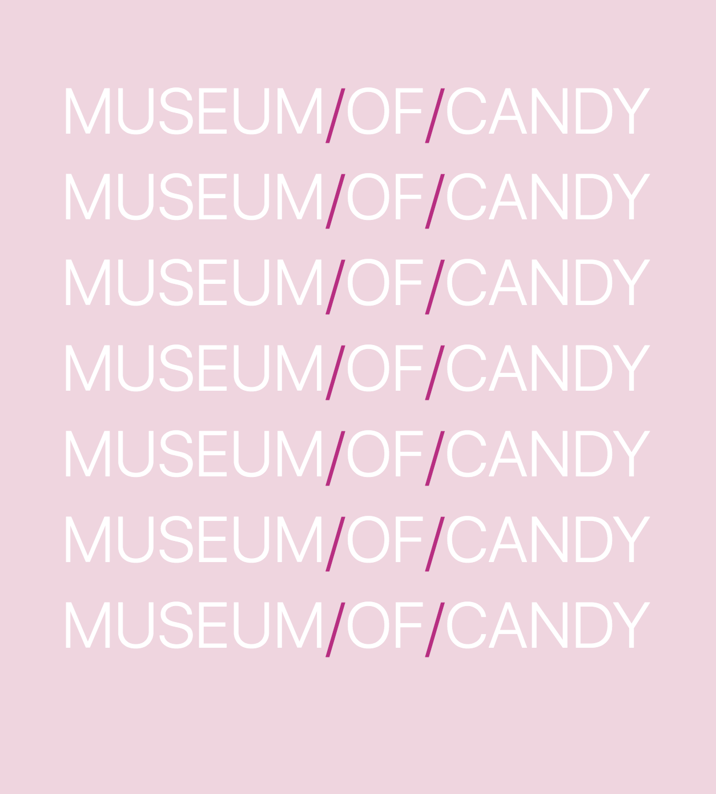
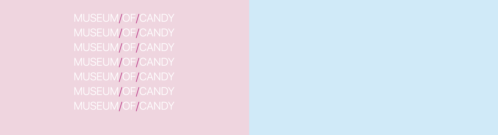

Museum Of Candy
======================
**[View Completed Project](https://coltonehrman.github.io/udacity-canvas-game)**

Created this project as part of Udemy Course - [Course Link](https://www.udemy.com/share/101W9CBUobdVZUQXo=/) to learn how to use [Bootstrap 4](https://getbootstrap.com/) in laying out Web pages in a modern grid layout.

## Structure Of Project
### NavBar

Transparent-Fixed NavBar 
With Custom Links

*Mobile*


*Normal*


```html
<!-- Transparent Fixed NavBar -->
<nav class="navbar navbar-light navbar-expand-md fixed-top bg-transparent">
    <span class="h3 mb-0 mr-4 text-uppercase font-weight-light" style="color: mediumvioletred">candy</span>

    <button class="navbar-toggler" type="button" data-toggle="collapse" data-target="#navbarNav" aria-controls="navbarNav" aria-expanded="false" aria-label="Toggle navigation">
        <span class="navbar-toggler-icon"></span>
    </button>
    
    <div class="collapse navbar-collapse" id="navbarNav">
        <ul class="navbar-nav">
            <li class="nav-item">
                <a class="nav-link h4 mb-0 text-white text-uppercase font-weight-light" href="#">Home</a>
            </li>
            <li class="nav-item">
                <a class="nav-link h4 mb-0 text-white text-uppercase font-weight-light" href="#">Features</a>
            </li>
            <li class="nav-item">
                <a class="nav-link h4 mb-0 text-white text-uppercase font-weight-light" href="#">Pricing</a>
            </li>
        </ul>
    </div>
</nav>
```

### First Section

Two Column Row 
Column One - Text 
Column Two - Picture

*Mobile*


*Normal*


```html
<div class="row">
    <div class="col-12 col-md-6" style="background-color: #F4D5E0; padding-top: 7rem; padding-bottom: 7rem;">
        <h2 class="display-4 text-center font-weight-light text-white text-uppercase">museum<span style="color: mediumvioletred">/</span>of<span style="color: mediumvioletred">/</span>candy</h2>
        <h2 class="display-4 text-center font-weight-light text-white text-uppercase">museum<span style="color: mediumvioletred">/</span>of<span style="color: mediumvioletred">/</span>candy</h2>
        <h2 class="display-4 text-center font-weight-light text-white text-uppercase">museum<span style="color: mediumvioletred">/</span>of<span style="color: mediumvioletred">/</span>candy</h2>
        <h2 class="display-4 text-center font-weight-light text-white text-uppercase">museum<span style="color: mediumvioletred">/</span>of<span style="color: mediumvioletred">/</span>candy</h2>
        <h2 class="display-4 text-center font-weight-light text-white text-uppercase">museum<span style="color: mediumvioletred">/</span>of<span style="color: mediumvioletred">/</span>candy</h2>
        <h2 class="display-4 text-center font-weight-light text-white text-uppercase">museum<span style="color: mediumvioletred">/</span>of<span style="color: mediumvioletred">/</span>candy</h2>
        <h2 class="display-4 text-center font-weight-light text-white text-uppercase">museum<span style="color: mediumvioletred">/</span>of<span style="color: mediumvioletred">/</span>candy</h2>
    </div>

    <div class="col-12 col-md-6" style="background-color: #CAECFA">
        <!-- picture colimn -->
    </div>
</div>
```